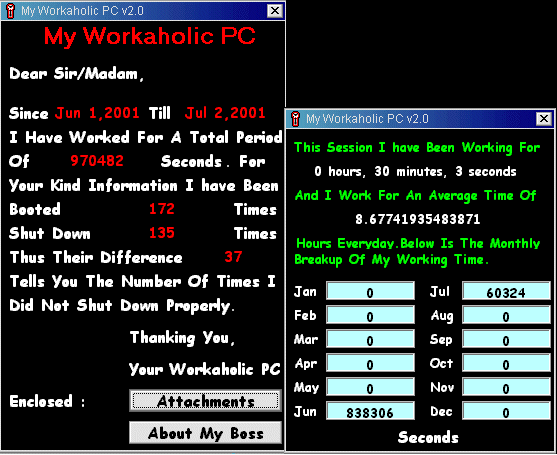



## My Workaholic PC v2\.0

### Description

Last Month's Popular Program is Back with a lot more new feature....again the screenshot says it all...Please vote and do Visit www.gauravcreations.com for exciting programs
 
### More Info
 

             |
---                |---
**Submitted On**   |2001-07-02 23:51:58
**By**             |[Gaurav Creations](https://github.com/Planet-Source-Code/PSCIndex/blob/master/ByAuthor/gaurav-creations.md)
**Level**          |Beginner
**User Rating**    |4.8 (19 globes from 4 users)
**Compatibility**  |VB 6\.0
**Category**       |[Complete Applications](https://github.com/Planet-Source-Code/PSCIndex/blob/master/ByCategory/complete-applications__1-27.md)
**World**          |[Visual Basic](https://github.com/Planet-Source-Code/PSCIndex/blob/master/ByWorld/visual-basic.md)
**Archive File**   |[My Workaho22082722001\.zip](https://github.com/Planet-Source-Code/gaurav-creations-my-workaholic-pc-v2-0__1-24657/archive/master.zip)

### API Declarations

Please rename the 2 .ex files to .exe to see how the program works.The code is also included

